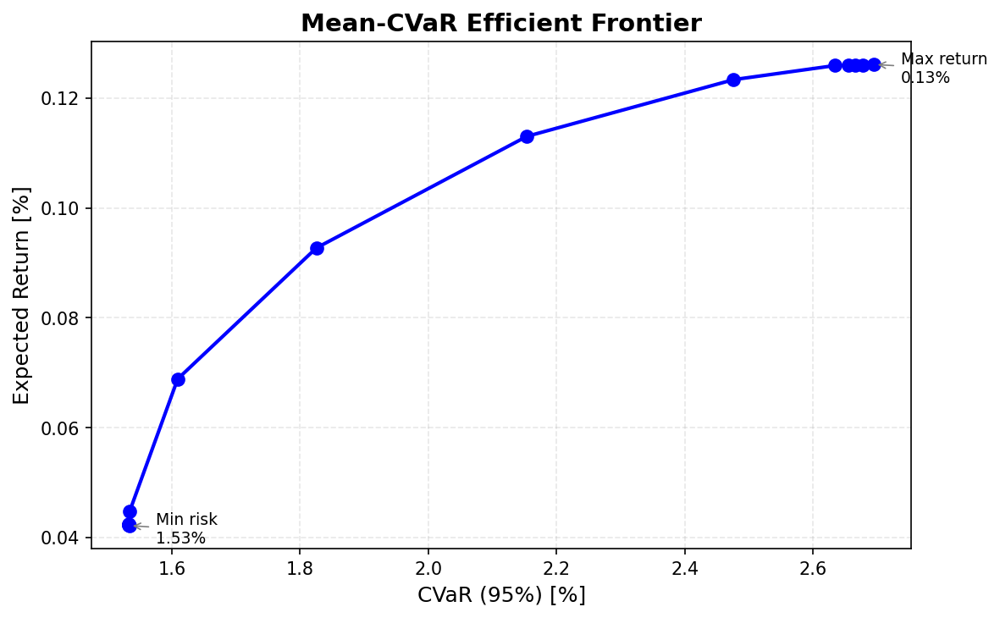
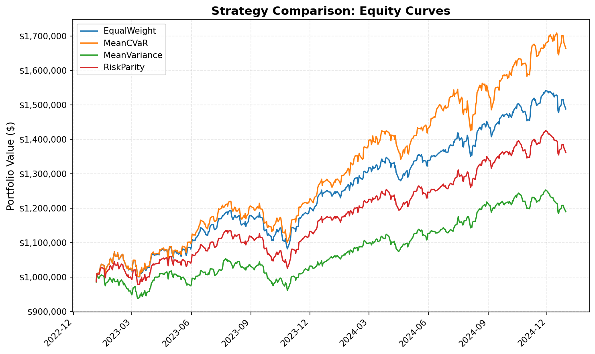

# cuda-portfolio-optimizer

GPU-accelerated portfolio optimization using Monte Carlo simulation and Mean-CVaR, with a custom ADMM solver implemented in C++17/CUDA and a rolling-window backtesting engine.

<p align="center">
  
  
</p>

## Motivation

Classical portfolio optimization (Markowitz mean-variance) has well-known limitations: sensitivity to estimation error, Gaussian return assumptions, and variance as a poor proxy for tail risk. CVaR (Conditional Value-at-Risk) addresses the tail risk problem, but the scenario-based formulation is computationally expensive -- you're solving over tens of thousands of Monte Carlo scenarios. This maps naturally to GPU parallelism: scenario generation is embarrassingly parallel, and the ADMM solver's per-iteration bottleneck is a matrix-vector product across all scenarios.

This project implements the full pipeline from scratch: return estimation, correlated Monte Carlo simulation on GPU, CVaR optimization via ADMM, efficient frontier computation, and backtesting with transaction costs.

## Architecture

```
                 ┌─────────────┐
                 │  Price CSV   │
                 └──────┬───────┘
                        │
                 ┌──────▼───────┐
                 │  Returns &   │
                 │  Covariance  │
                 └──────┬───────┘
                        │
                 ┌──────▼───────┐     ┌─────────────────┐
                 │   Cholesky   │────►│  L (lower tri)   │
                 │ Decomposition│     └────────┬─────────┘
                 └──────────────┘              │
                                        ┌──────▼───────┐
                                        │  Monte Carlo  │  GPU: cuRAND + custom kernel
                                        │  Scenarios    │  r = mu + L*z, z ~ N(0,I)
                                        └──────┬───────┘
                                               │
                         ┌─────────────────────┬┘
                         │                     │
                  ┌──────▼───────┐     ┌───────▼──────┐
                  │ ADMM Solver  │     │  Backtester   │
                  │ (Mean-CVaR)  │     │ (rolling win) │
                  └──────┬───────┘     └───────┬───────┘
                         │                     │
                  ┌──────▼───────┐     ┌───────▼──────┐
                  │  Efficient   │     │  Equity Curve │
                  │  Frontier    │     │  + Comparison │
                  └──────┬───────┘     └───────┬───────┘
                         │                     │
                  ┌──────▼─────────────────────▼──────┐
                  │        CSV / JSON Reports          │
                  └────────────────────────────────────┘
```

```
src/
  core/          Fundamental types, config, portfolio result structs
  data/          Market data loader (CSV), return computation, universe definition
  models/        Return distribution models: PCA factor model, factor Monte Carlo, Ledoit-Wolf shrinkage
  simulation/    GPU Monte Carlo scenario generator (correlated returns via Cholesky + cuRAND)
  risk/          CVaR computation (CUDA), VaR, volatility, drawdown metrics
  optimizer/     ADMM solver (C++/CUDA), projections, efficient frontier
  constraints/   Portfolio constraints: position limits, leverage, turnover, sector
  backtest/      Rolling-window backtesting engine with transaction costs
  reporting/     Efficient frontier, risk decomposition, strategy comparison (CSV/JSON)
  utils/         Timer, logging, CUDA helpers
apps/            CLI executables (optimize, backtest)
tests/           Google Test unit tests (188 tests)
benchmarks/      GPU vs CPU performance comparison (Google Benchmark)
scripts/         Python helpers: cvxpy validation, data generation, plotting
```

## What's Implemented

**Monte Carlo Scenario Generation (CUDA)** -- Covariance estimation from historical returns, Cholesky decomposition (CPU), correlated sample generation on GPU via cuRAND. Column-major scenario matrix layout for coalesced memory access.

**Factor Model (PCA)** -- PCA-based covariance estimation: R = Bf + eps, Sigma = B*Sigma_f*B' + diag(D). Reduces estimation from N(N+1)/2 to Nk + k(k+1)/2 + N parameters. Auto-selection of k by variance explained threshold. Factor-based Monte Carlo kernel: O(Nk) per scenario vs O(N^2) for full Cholesky -- **15.6x speedup at 500 assets**.

**Ledoit-Wolf Shrinkage** -- Optimal shrinkage covariance estimator (Ledoit & Wolf, 2004). Computes the analytically optimal shrinkage intensity toward a scaled-identity target, eliminating manual tuning. Especially valuable when T (sample size) is close to N (number of assets) -- exactly the regime of daily returns with dozens of stocks. Enable with `"use_ledoit_wolf": true` in any config JSON.

**Risk Computation (CUDA)** -- Portfolio loss computation: one CUDA thread per scenario. VaR and CVaR via GPU-accelerated sort (CUB) + reduction. Component CVaR decomposition: per-asset risk contribution via two-pass threshold kernel (sum of components = total CVaR).

**ADMM Optimizer (C++/CUDA)** -- Rockafellar-Uryasev formulation of Mean-CVaR. ADMM with proximal gradient x-update evaluated on GPU via pre-allocated device buffers (~6000 kernel calls per solve, zero malloc/free overhead). CPU z-update/u-update (cheap projections). Dykstra's alternating projection for constraint handling. Supports position limits, turnover, and sector exposure bounds.

**Efficient Frontier** -- Target-return sweep with warm-starting between solves.

**Backtesting Engine** -- Rolling-window rebalancing on historical data. Proportional transaction costs with minimum trade threshold. Strategy comparison: Mean-Variance, Mean-CVaR, Equal-Weight (1/N), Risk Parity.

## Performance (Measured on RTX 3060)

### Monte Carlo Scenario Generation

| Configuration | GPU | CPU | Speedup |
|---|---|---|---|
| 10K scenarios x 50 assets | 31 ms | 32 ms | 1.0x |
| 50K scenarios x 100 assets | 32 ms | 400 ms | **12.5x** |
| 100K scenarios x 100 assets | 99 ms | 722 ms | **7.3x** |
| 100K scenarios x 500 assets | 1098 ms | -- | -- |

GPU advantage grows with problem size. At 50K x 100, GPU is 12.5x faster. The 10K x 50 case is too small to offset kernel launch overhead.

### ADMM Optimization (50K scenarios)

| Assets | CPU | GPU | Speedup |
|---|---|---|---|
| 2 | 214 ms | 297 ms | 0.72x |
| 5 | 208 ms | 320 ms | 0.65x |
| 10 | 312 ms | 422 ms | 0.74x |
| 25 | 1,141 ms | 734 ms | **1.55x** |
| 50 | 4,109 ms | 844 ms | **4.87x** |
| 75 | 13,219 ms | 1,266 ms | **10.4x** |
| 100 | 24,406 ms | 2,750 ms | **8.9x** |

**GPU crossover at ~20 assets.** Below that, kernel launch and host-device sync overhead per ADMM iteration exceeds the compute savings. Above 25 assets, the GPU's parallel scenario evaluation dominates and the speedup grows rapidly -- 10x at 75 assets.

### Efficient Frontier (5 points)

| Assets | Scenarios | CPU | GPU | Speedup |
|---|---|---|---|---|
| 3 | 20K | 352 ms | 1,062 ms | 0.33x |
| 5 | 20K | 578 ms | 1,703 ms | 0.34x |
| 10 | 20K | 953 ms | 2,609 ms | 0.37x |
| 25 | 50K | 7,076 ms | 3,375 ms | **2.10x** |
| 50 | 50K | 21,249 ms | 3,812 ms | **5.57x** |

### Full Pipeline (scenario generation + ADMM solve)

| Assets | Scenarios | CPU | GPU | Speedup |
|---|---|---|---|---|
| 5 | 50K | 234 ms | 271 ms | 0.86x |
| 10 | 50K | 320 ms | 289 ms | **1.11x** |
| 25 | 50K | 1,156 ms | 531 ms | **2.18x** |
| 50 | 50K | 4,188 ms | 1,016 ms | **4.12x** |
| 100 | 50K | 27,531 ms | 1,375 ms | **20.0x** |

The full pipeline (cuRAND scenario generation + GPU ADMM) breaks even at ~10 assets and scales to **20x speedup at 100 assets**. At portfolio sizes typical in practice (25-100 stocks), the GPU advantage is substantial.

### VRAM Usage (RTX 3060, 6 GB)

| Component | 100K x 500 |
|---|---|
| Scenario matrix (float32) | 191 MB |
| cuRAND states | 5 MB |
| Cholesky factor | 1 MB |
| ADMM working buffers | ~200 MB |
| **Total** | **~397 MB** (6.5% of 6 GB) |

## Building

### Prerequisites
- NVIDIA GPU (compute capability 7.0+)
- CUDA Toolkit 12.0+
- C++17 compiler (MSVC 2022, GCC 9+, Clang 10+)
- CMake 3.20+

### Build

```bash
git clone https://github.com/<username>/cuda-portfolio-optimizer.git
cd cuda-portfolio-optimizer

# Visual Studio generator (Windows)
cmake -B build -G "Visual Studio 17 2022"
cmake --build build --config Release

# Or Ninja (faster incremental builds)
cmake -B build -DCMAKE_BUILD_TYPE=Release -G Ninja
cmake --build build
```

All dependencies (Eigen, nlohmann/json, spdlog, Google Test, Google Benchmark) are fetched automatically via CMake FetchContent. Only CUDA must be pre-installed.

### Test

```bash
ctest --test-dir build -C Release --output-on-failure
# 188 tests, all passing
```

### Run

```bash
# Download real S&P 500 data
pip install -r scripts/requirements.txt
python scripts/download_data.py                  # 10 stocks (default)
python scripts/download_data.py --universe 50    # 48 stocks across 11 GICS sectors

# Portfolio optimization (efficient frontier)
./build/Release/optimize --config config/optimize_sp500.json --output results/optimize_sp500/

# 50-stock optimization (GPU, factor model, 100K scenarios, 10% position limits)
./build/Release/optimize --config config/optimize_sp500_50.json --output results/optimize_sp500_50/

# 50-stock optimization with Ledoit-Wolf shrinkage (sample covariance path)
./build/Release/optimize --config config/optimize_sp500_50_lw.json --output results/optimize_sp500_50_lw/

# Backtest with strategy comparison
./build/Release/backtest --config config/backtest_sp500.json --output results/backtest_sp500/
./build/Release/backtest --config config/backtest_sp500_50.json --output results/backtest_sp500_50/

# Backtest with Ledoit-Wolf shrinkage
./build/Release/backtest --config config/backtest_sp500_50_lw.json --output results/backtest_sp500_50_lw/

# Generate plots
python scripts/plot_frontier.py results/optimize_sp500/frontier.csv -o docs/images/frontier.png
python scripts/plot_backtest.py results/backtest_sp500/ -o docs/images/equity_curves.png

# Benchmarks
./build/Release/bench_monte_carlo
./build/Release/bench_cvar
./build/Release/bench_admm
./build/Release/bench_factor_model
```

#### Quick start (synthetic data)

No Python or internet needed -- use the synthetic data configs:
```bash
python scripts/generate_sample_data.py
./build/Release/optimize --config config/optimize_5asset.json --output results/optimize/
./build/Release/backtest --config config/backtest_5asset.json --output results/backtest/
```

## Example: 50-Stock Efficient Frontier (GPU)

```bash
python scripts/download_data.py --universe 50
./build/Release/optimize --config config/optimize_sp500_50.json --output results/optimize_sp500_50/
```

Output (48 S&P 500 stocks across 11 GICS sectors, 100K scenarios, factor model, 10% position limits):
```
Efficient Frontier (15 points)
    Target Ret Achieved Ret         CVaR  Iters  Conv
     -0.000760     0.000422     0.015333    500    no
     -0.000518     0.000423     0.015331    163   yes
      0.000448     0.000448     0.015342    206   yes
      0.001173     0.001130     0.021537    341   yes
      0.001656     0.001259     0.026338     75   yes
      0.002623     0.001261     0.026956    315   yes

Risk Decomposition (min-CVaR point):
       JNJ: weight=0.1000  CVaR_j=0.001321  (8.6%)
       MCD: weight=0.1000  CVaR_j=0.001451  (9.5%)
        PG: weight=0.1000  CVaR_j=0.001475  (9.6%)
        KO: weight=0.1000  CVaR_j=0.001462  (9.5%)
       PEP: weight=0.1000  CVaR_j=0.001491  (9.7%)
       DUK: weight=0.0712  CVaR_j=0.001162  (7.6%)
       ... (48 stocks, 23 with non-zero weight)
```

The optimizer diversifies across defensive sectors (consumer staples, utilities, health care) at the 10% position cap, with component CVaR correctly summing to total.

Results are written to `results/optimize_sp500_50/frontier.csv` and `results/optimize_sp500_50/frontier_result.json`.

## Example: Ledoit-Wolf Shrinkage (50 Stocks)

```bash
./build/Release/optimize --config config/optimize_sp500_50_lw.json
```

Same 48 stocks, but using Ledoit-Wolf optimal shrinkage on the sample covariance instead of the factor model:

```
Ledoit-Wolf shrinkage intensity: 0.0183
  (T=751, N=48 — sample cov well-estimated, light shrinkage)

Efficient Frontier (15 points)
    Target Ret Achieved Ret         CVaR  Iters  Conv
     -0.000760     0.000435     0.015271    500    no
     -0.000518     0.000432     0.015269    264   yes
      0.000448     0.000448     0.015273    109   yes
      0.001173     0.001145     0.021604    378   yes
      0.001656     0.001259     0.026040     74   yes
      0.002623     0.001261     0.026614    117   yes

Risk Decomposition (min-CVaR point):
       JNJ: weight=0.1000  CVaR_j=0.001304  (8.5%)
       MCD: weight=0.1000  CVaR_j=0.001478  (9.7%)
        PG: weight=0.1000  CVaR_j=0.001506  (9.9%)
        KO: weight=0.1000  CVaR_j=0.001503  (9.8%)
       PEP: weight=0.0836  CVaR_j=0.001306  (8.6%)
       DUK: weight=0.0636  CVaR_j=0.000990  (6.5%)
       ... (48 stocks, 23 with non-zero weight)
```

With T/N = 15.6, the LW estimator applies only 1.8% shrinkage -- the sample covariance is already well-estimated. The resulting frontier closely matches the factor model frontier, with the same defensive-sector tilt at the minimum-CVaR point. Enable with `"use_ledoit_wolf": true` in any config JSON (set `"covariance_method": "sample"`).

## Example: Backtest

```bash
./build/Release/backtest --config config/backtest_sp500_50.json --output results/backtest_sp500_50/
```

4-strategy comparison on 48 S&P 500 stocks (2023-2024, monthly rebalancing, GPU-accelerated MeanCVaR):

| Strategy | Total Return | Ann. Return | Sharpe | Max Drawdown |
|---|---|---|---|---|
| MeanCVaR | 68.7% | 30.2% | 2.24 | 9.8% |
| EqualWeight | 50.8% | 23.1% | 2.00 | 9.4% |
| RiskParity | 38.1% | 17.7% | 1.67 | 9.7% |
| MeanVariance | 20.7% | 10.0% | 1.05 | 8.7% |

Outputs equity curves, weights, and strategy comparison (CSV + JSON) for all four strategies.

### With Ledoit-Wolf Shrinkage

```bash
./build/Release/backtest --config config/backtest_sp500_50_lw.json --output results/backtest_sp500_50_lw/
```

Same 4-strategy comparison with `"use_ledoit_wolf": true`. LW replaces the fixed shrinkage intensity (0.5) for MeanVariance and applies optimal shrinkage to the sample covariance used by MeanCVaR:

| Strategy | Total Return | Ann. Return | Sharpe | Max Drawdown |
|---|---|---|---|---|
| MeanCVaR | 68.7% | 30.2% | 2.24 | 9.8% |
| EqualWeight | 50.8% | 23.1% | 2.00 | 9.4% |
| RiskParity | 38.1% | 17.7% | 1.67 | 9.7% |
| MeanVariance | 22.8% | 10.9% | 1.12 | 10.2% |

MeanVariance improves from 10.0% to 10.9% annualized return (Sharpe 1.05 to 1.12) with LW replacing the fixed 0.5 shrinkage -- the data-driven intensity adapts per rebalance window. MeanCVaR and the non-covariance strategies (EqualWeight, RiskParity) are unchanged.

## Validation

Optimization results are validated at multiple levels:

1. **Analytical** -- 2-asset closed-form efficient frontier (Markowitz)
2. **Cross-reference** -- ADMM results compared against Python cvxpy + ECOS solver. Weight L-inf difference < 0.05 for small problems, CVaR relative difference < 10%
3. **Statistical** -- Monte Carlo convergence tests (sample moments approach true parameters as N increases)
4. **Structural** -- Efficient frontier monotonicity, CVaR >= VaR, constraint satisfaction
5. **Shrinkage** -- Ledoit-Wolf intensity bounds, positive definiteness, symmetry, consistency with naive formula at same intensity, monotonicity (more data = less shrinkage)

Cross-validation workflow:
```bash
pip install -r scripts/requirements.txt
python scripts/validate_cvxpy.py    # Generates reference JSON
ctest --test-dir build -C Release   # C++ test loads and compares
```

## The Math

**CVaR** measures the average loss in the worst alpha% of outcomes. For a portfolio with weights w and scenario returns r_i:

- VaR_alpha = inf{ zeta : P(-r'w <= zeta) >= alpha }
- CVaR_alpha = E[-r'w | -r'w >= VaR_alpha]

The **Rockafellar-Uryasev** reformulation makes CVaR minimization tractable:

```
min_{w,zeta}  zeta + 1/(N*alpha) * sum_i max(0, -r_i'w - zeta)
s.t.  mu'w >= target_return,  1'w = 1,  w >= 0,  constraints
```

**ADMM** decomposes the constrained problem:
1. **x-update**: proximal gradient on augmented Lagrangian (scenarios -- GPU-acceleratable)
2. **z-update**: project onto constraint set via Dykstra's alternating projections
3. **u-update**: dual variable gradient ascent

**Correlated simulation**: given Sigma = LL' (Cholesky), generate r = mu + Lz where z ~ N(0,I).

## Dependencies

| Library | Purpose | Acquisition |
|---|---|---|
| CUDA 12+ | Compute kernels, cuRAND, CUB | Pre-installed |
| Eigen3 | CPU linear algebra, Cholesky | FetchContent |
| nlohmann/json | Config and output serialization | FetchContent |
| spdlog | Logging | FetchContent |
| Google Test | Unit tests | FetchContent |
| Google Benchmark | CPU vs GPU benchmarks | FetchContent |

## Roadmap

Phases 1-11 are complete (build system through 50-stock demo). See [ROADMAP.md](ROADMAP.md) for full details.

**Up next:**

| Phase | Feature | Summary |
|---|---|---|
| 12 | ADMM Convergence | Over-relaxation, Anderson acceleration, backtracking line search. Target: 15/15 frontier points at 50 stocks |
| 13 | Black-Litterman | Market equilibrium + investor views for return estimation. Posterior feeds into existing MC + ADMM pipeline |
| 14 | Python Bindings | pybind11 wrapper with NumPy interop. Call GPU optimizer from Python/Jupyter |
| 15 | GitHub Actions CI | Two-tier CI: build + CPU tests on hosted runners, full GPU suite on self-hosted |

## References

1. Rockafellar & Uryasev, [Optimization of Conditional Value-at-Risk](https://doi.org/10.21314/JOR.2000.038), Journal of Risk 2000
2. Boyd et al., [Distributed Optimization and Statistical Learning via ADMM](https://stanford.edu/~boyd/admm.html), Found. & Trends in ML 2011
3. Ledoit & Wolf, [Honey, I Shrunk the Sample Covariance Matrix](http://www.ledoit.net/honey.pdf), 2004
4. Duchi et al., [Efficient Projections onto the l1-Ball](https://stanford.edu/~jduchi/projects/DuchiShSiCh08.pdf), ICML 2008
5. Markowitz, Portfolio Selection, Journal of Finance 1952

## License

MIT
